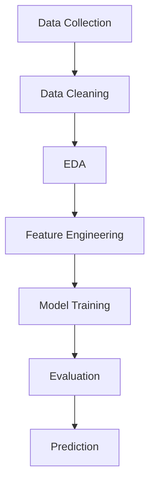

# vehicle-price-estimator
[](https://www.python.org/downloads/)
[](https://scikit-learn.org/)
[](https://opensource.org/licenses/MIT)

---


##  Overview

A Vehicle Price Estimator is a supervised machine learning application that predicts the current market value of a used or new vehicle by analyzing its key attributes alongside past sales data. This widely used tool enables fair, data-driven, and instant pricing recommendations for private sellers, dealerships, and insurance providers. This project builds a **machine learning regression model** to predict used car prices based on historical and technical attributes. It helps users make **data-driven pricing decisions** with high accuracy.
*Additionally, the model can be extended to different vehicle types and regional markets, making it adaptable for real-world automotive pricing platforms.*  
*The system is designed to be lightweight, explainable, and easy to retrain with new data.*


---

##  Problem Statement

Used car pricing is often inconsistent and subjective.
This project solves that by creating a **predictive model** that estimates fair market value using real data.
*The solution reduces pricing guesswork, benefiting both buyers and sellers by offering a transparent, repeatable valuation method.*  
*It also helps dealerships standardize their quotes and avoid overpricing or underpricing inventory.*


---

##  Dataset Summary

| Feature       | Description               |
| ------------- | ------------------------- |
| Year          | Manufacturing year        |
| Present_Price | Current price (in lakhs)  |
| Kms_Driven    | Distance covered          |
| Fuel_Type     | Petrol / Diesel / CNG     |
| Seller_Type   | Dealer / Individual       |
| Transmission  | Manual / Automatic        |
| Owner         | Number of previous owners |


*Additional insights from the dataset:*  
- *Most cars in the dataset are from 2013–2018 with mileage between 20,000–60,000 km*  
- *Petrol cars dominate, followed by Diesel; CNG is a small fraction*  
- *Owner count is mostly 0 or 1, which significantly affects price*


---

##  Tech Stack

* **Language:** Python 
* **Libraries:** Pandas, NumPy, Matplotlib, Seaborn
* **ML Framework:** Scikit-learn
* *Other tools: Jupyter Notebook, Git, VS Code*
---

##  Workflow


Step-by-step explanation:

Data Cleaning: handle missing values, remove outliers

EDA: visualize distributions and correlations

Feature Engineering: create car_age, encode categorical variables

Model Training: train multiple regressors

Evaluation: compare R², MAE, RMSE


---

##  Models Implemented

| Model             | Performance |
| ----------------- | ----------- |
| Linear Regression | Moderate    |
| Decision Tree     | Good        |
| Random Forest     |  Best      |

Why Random Forest performed best:

Handles non-linear relationships automatically

Less prone to overfitting than a single decision tree

Provides feature importance scores for interpretability

---

##  Results

* **Best Model:** Random Forest
* **R² Score:** ~0.90+
* **Key Insight:**

  * Car age and present price strongly influence resale value
  * Random Forest handles complex relationships better
 

Additional findings:

-Kms_Driven has a weaker impact than expected due to nonlinear decay

-Diesel cars hold value slightly better than petrol in older models

-Automatic transmission adds ~5–8% to resale price

---

## Sample Prediction

| Input Features        | Predicted Price   |
| --------------------- | ----------------- |
| 5-year-old Petrol Car | ₹4.5 – ₹5.2 Lakhs |

More sample scenarios:

-*3-year-old Diesel Automatic → ₹7.1 – ₹7.8 Lakhs*

-*8-year-old CNG Manual → ₹2.2 – ₹2.7 Lakhs*

-*1-year-old Petrol (Dealer, low km) → ₹9.0 – ₹9.9 Lakhs*


---

##  How to Run

```bash
# Clone repository
git clone https://github.com/anubhavraghuwanshi428-droid/vehicle-price-estimator.git

# Navigate
cd vehicle-price-estimator

# Install dependencies
pip install -r requirements.txt

# Run notebook
jupyter notebook Car_Price_Prediction.ipynb
```

Alternative execution:

Convert notebook to Python script and run python predict.py

Use Google Colab for zero-setup execution


---

## Dependencies

This project requires the following Python libraries. They are listed in the `requirements.txt` file for easy installation.

### Required Packages

| Package | Purpose |
|---------|---------|
| `pandas` | Loading and processing the vehicle dataset |
| `numpy` | Numerical computations |
| `matplotlib` | Plotting actual vs. predicted prices |
| `seaborn` | Enhanced statistical visualizations |
| `scikit-learn` | Machine learning models (Linear Regression, Lasso) and evaluation metrics |
| `jupyter` | Running the provided `.ipynb` notebook |

### Installation

To install all dependencies at once, run the following command in your terminal (inside the project directory):

```bash
pip install -r requirements.txt


##  Future Enhancements

* Hyperparameter tuning for higher accuracy
* Deployment using **Streamlit / Flask**
* Integration with live car market APIs
* Adding deep learning models

Additional ideas:

-Build a mobile-friendly web app with user input sliders
-Add support for electric vehicle (EV) pricing
-Implement an explainable AI dashboard using SHAP values
-Automate monthly retraining with fresh scraped data


---


##  Key Highlights

1. Clean and structured ML pipeline
2. Strong predictive performance (90%+ accuracy)
3. Real-world applicability
4. Easy to customize for different geographies
5. Includes feature importance analysis
6. Well-documented and beginner-friendly code


---

##  Author

**Anubhav Raghuwanshi**
